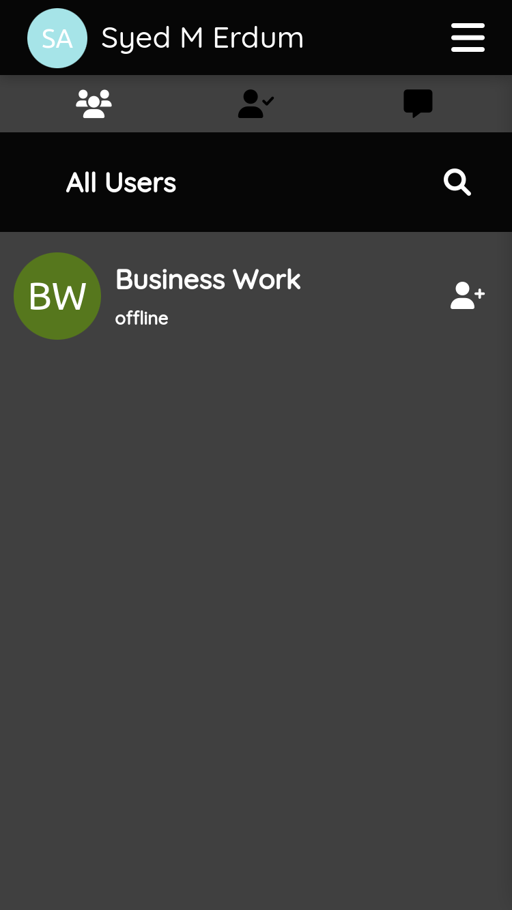

# Mulit User Chat Web App

A simple web-based chat application where multiple users can chat with each other in a simple manner.

## Features

- cross-platform all browsers are supported
- no OTP or authentication required
- no installation is required
- notifications and offline functionality (coming soon)

## Tech Stack

**Client:** Html5, CSS3, Javascript

**Server:** Firbase

## License

[MIT](https://choosealicense.com/licenses/mit/)

## Usage

- After authenticating with your Google account you will come to the global list of users where every user on the platform can be found, and you can send friend requests to them

 

- You can also view the friend requests you have received in the requests section

 

- When someone accepts your friend request then he will be moved from the global list to your friends list and you can chat with him
- You can also see the last seen of your friend

 

- You can now chat with your friends
- The application will also show the online/offline status along with the typing status as a small dot on the avatar of your friend
- If you allow notifications then you will receive a notification when a new message arrives

## Feedback

It's not perfect but, I made this out fun, and it can teach you a lot about web applications in general. I will improve it in the future if I get the time. You can also modify & contribute anything to it as you like all the reasonable PR's are open.

If you have any feedback, please reach out to us at erdumadnan@gmail.com
